# Домашнее задание 2

## Блок 1
В докере поднял spark-master, 2 spark-worker, zeppelin и hdfs. Даже сделал по 1 DN, NM, потому что не суть задания. 
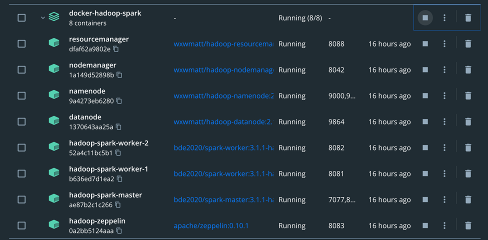
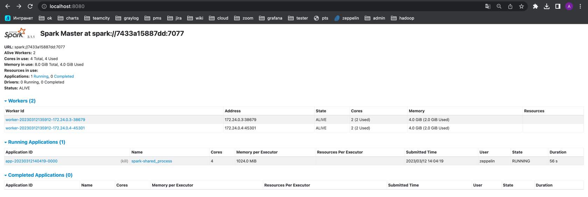
В zeppelin запустил в ячейке "1". Таким образом проверил, что успешно создался интерпретатор spark и scala код выполняется.  
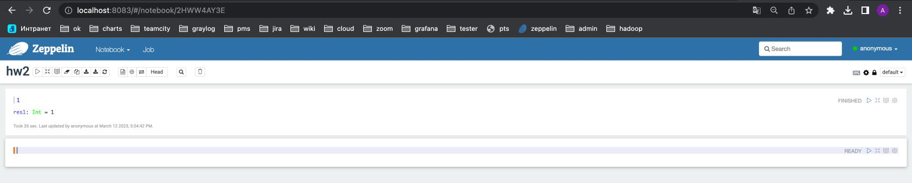

## Блок 2
Для начала взял одну из csv датасета и сравнил её размеры в csv и parquet форматах.
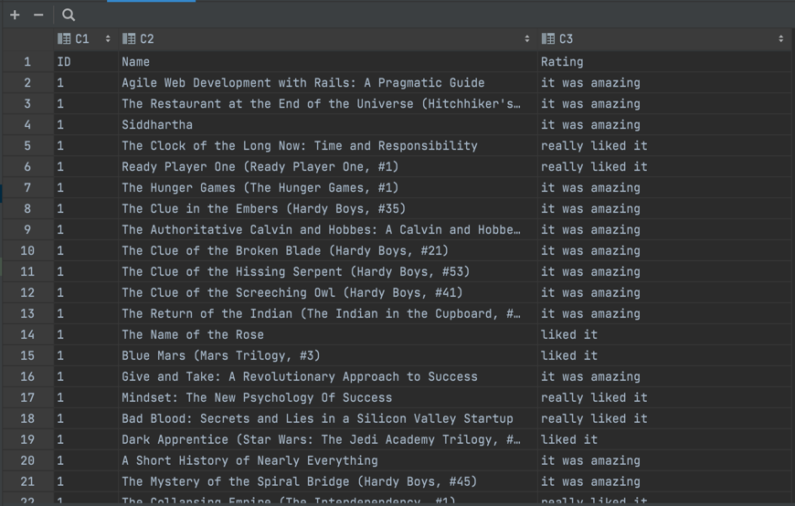  
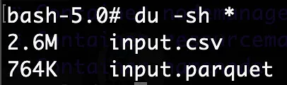  
Из фото видно, что parquet занимает в 3,5 раза меньше места.  

Затем смерджил все таблицы book* в одну и записал её в hdfs в двух форматах.
- csv с учетом RF=3 занимает 447MB.
- parquet с учетом RF=3 занимает 235MB. 

На данном датасете csv занимает в 1,9 раз больше места чем parquet. Стоит отметить, что в случае больших данных оптимизация памяти в 2 раза может избавить компанию от существенных расходов и ускорить передачу данных по сети, поэтому это серьезное преимущество.  
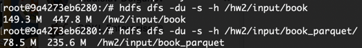  
Аналогичную процедуру проделал с датасетом user_rating*.
- csv с учетом RF=3 занимает 53MB.
- parquet с учетом RF=3 занимает 15MB.

На данном датасете csv занимает в 2,8 раз больше места чем parquet.
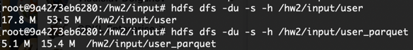
  
Предполагаю, это связано с тем, что:
- Значения столбца Rating принимают мало значений, поэтому при сжатии по столбцу Rating можно физически хранить числа 0, 1, 2, .., а не сами строки. В случае parquet такое сжатие может произойти, а в случае csv нет.
- Даже если первая оптимизация не произойдет, так как у столбца Rating часто идут подряд одинаковые значения, отлично сработает сжатие вида "x,x,x,x,x,x" -> "x,6". Тоже возможна только в случае parquet.
- Так как каждый пользователь мог оценить множество книг, отлично сработает дельта кодирование по столбцу ID.
- Столбец Name тоже явно можно хорошо сжать, потому что там много часто встречающихся английских слов, в таком случае хорошо сработает алгоритм Хаффмана.  

В общем, хранение по столбцам в случае данного датасета может быть выполнено значительно эффективнее чем хранение по строкам, что подтверждается на практике.  

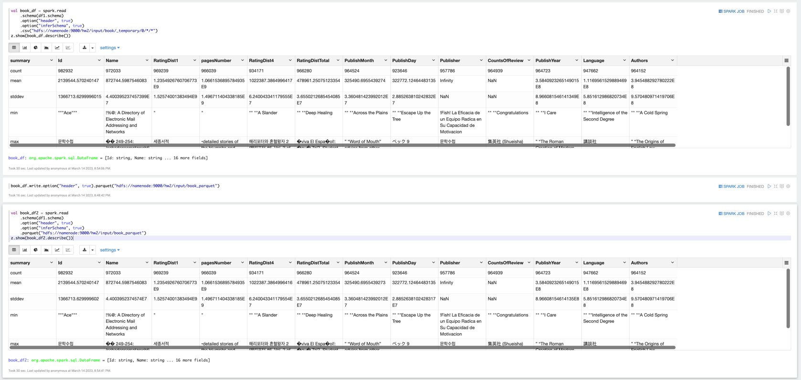
При чтении разница в скорости не заметна, оба файла достаточно маленькие и читаются за 30 секунд (describe сделал, чтобы был action), но если порассуждать:
- Так как parquet содержит меньше байт, то при прочих равных он скачается быстрее и меньше нагрузит сеть.
- Так как parquet хранит данные колонками, если нам нужна только часть колонок, можно прочитать только их. Более того, так как значения одной колонки хранятся в памяти рядом (относительно того, как они разбросаны по памяти в случае csv), может потребоваться значительно меньше обращений к диску.
- Работать с csv проще, так как для parquet необходимо указывать схему при чтении или записи, что несколько усложняет код. Так что разница в скорости написания кода на стороне csv.

### Предобработка
- Так как 23 входных csv имеют разную схему, местами не совместимую по типам данных: во-первых, преобразовал каждую из них в parquet, во-вторых, удалил колонки, присутствующие не во всех таблицах, в-третьих, привел все колонки к наиболее адекватному типу данных (например, скастовал колонки с числами в int). Код приводить не буду, он простой и не интересный.
- Для одного из следующих заданий понадобятся колонки RatingDist*. В них данные в формате "4:2", "total:4", преобразовал к удобному виду "2", "4".
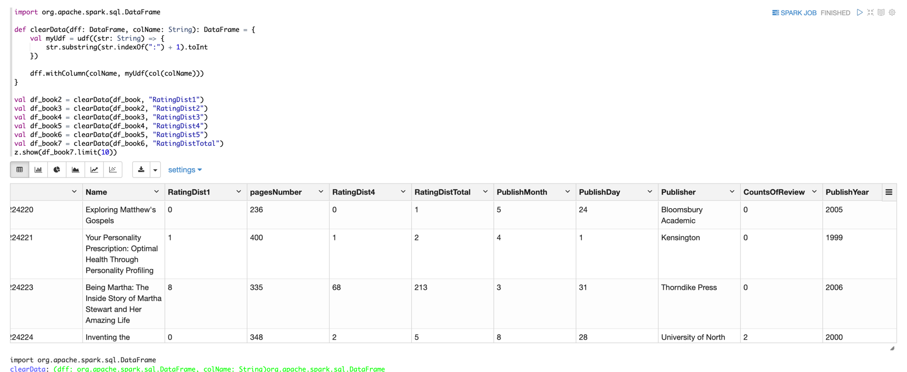

### 2.a)
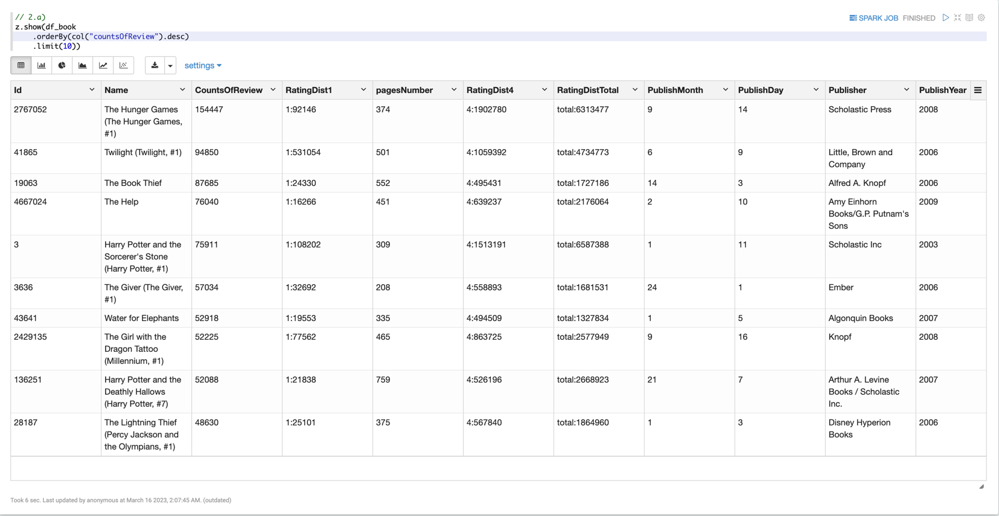

### 2.b)
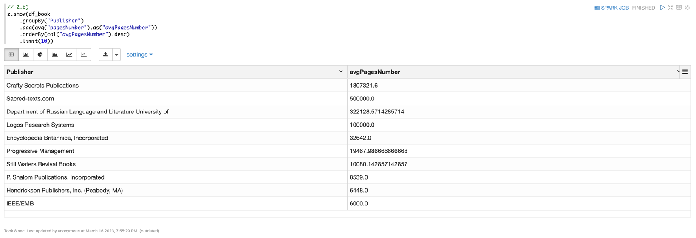

### 2.c)
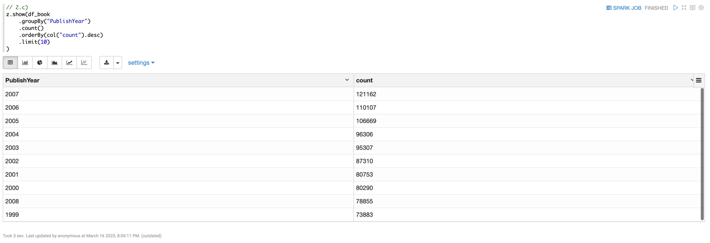

### 2.d)
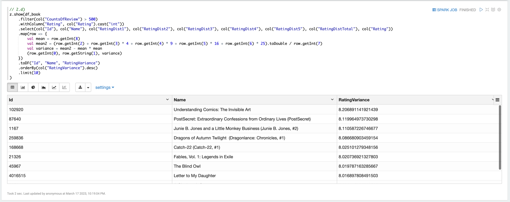

### 2.e)
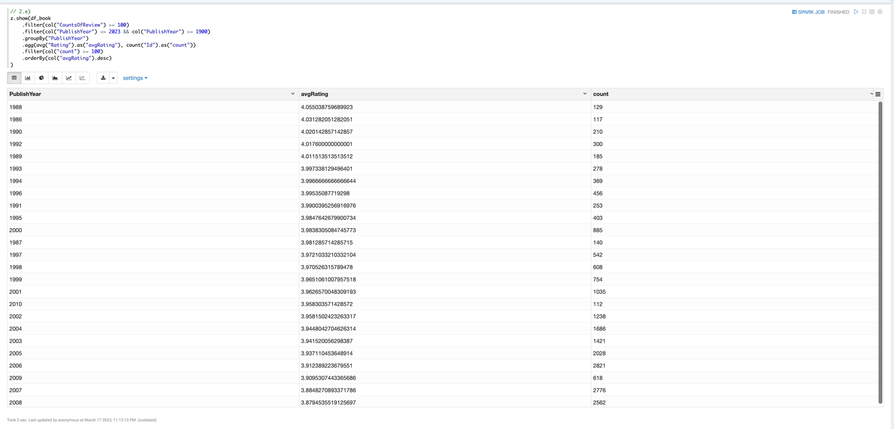
Инсайт состоит в том, что, судя по среднему рейтингу книг в году, люди оценивают литературу 20-о века выше литературы 21-о века, так как при упорядочении по среднему рейтингу годы из 21-о века оказываются в самом низу списка.    
Для состоятельности аналитики я рассматривал только книги, имеющие хотя бы 100 ревью, и годы, в которых имеется хотя бы 100 таких книг.  
Даже немного грустно от такого инсайта.  

## Блок 3
Для начала я преобразовал словестные оценки в числовые  
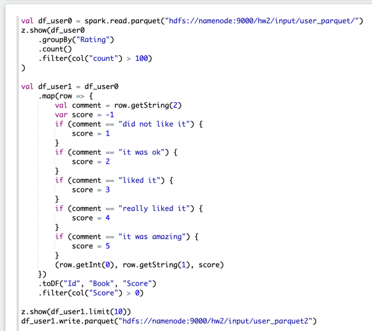  
В самой стриминговой джобе я группирую по времени и названию книги и вычисляю среднюю оценку пользователей.  
Чтобы получить результат пришлось еще раз залить данные в hdfs файл, потому что уже находящиеся там данные spark считает неактуальными в момент groupBy по window. Пробовал с другими параметрами (withWatermark и window), но spark все равно их игнорирует.  
Так как в самом датасете таймстемпа у данных нет, я в момент загрузки проставляю всем строчкам одинаковое значение `current_timestamp()`, поэтому лага в данных у меня не бывает и в `withWatermark` можно поставить сколь угодно маленькое число, я выбрал "1 second".  
Так как все данные прилетают с одним таймстемпом, то параметр размера окна в groupBy window тоже не имеет значения, выставил "10 seconds".  
Параметр `Trigger.ProccessingTime` выставил по аналогии с размером окна, если я считаю агрегаты за 10 секунд, то выполнять сам расчет логично раз в 10 секунд.  
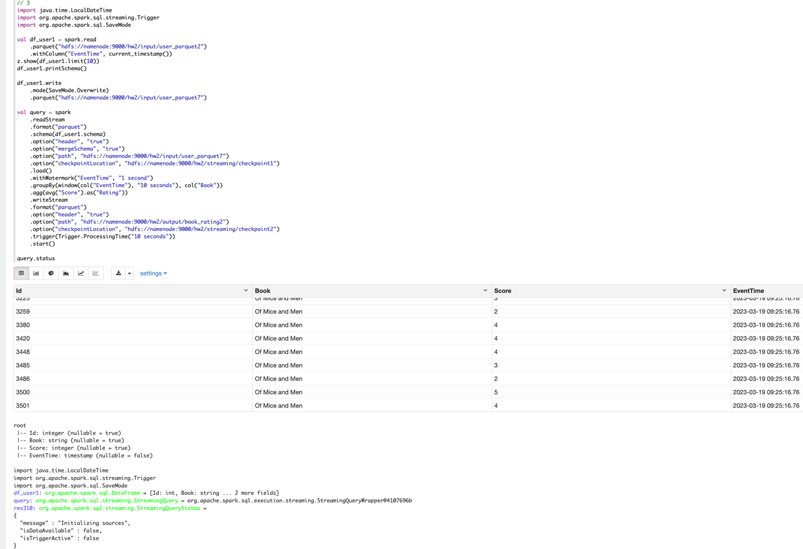  
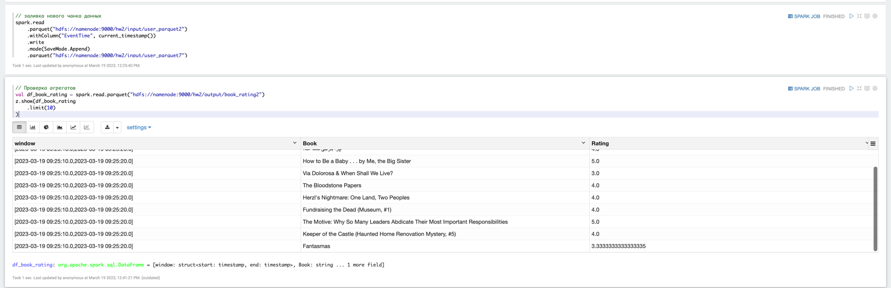